# YoSpace

一个基于 Next.js App Router 的个人主页项目，包含个人介绍、博客、友链与全站音乐播放器。整体以组件化组织，强调响应式体验与可维护性。

当你已经：

- 日常写 React / TypeScript；
- 使用 Next.js 做 SSR / SSG / App Router；
- 在 GitHub / Vercel / 各类静态或函数部署 上管理一切；

那不妨让博客也加入这条流水线：内容跟着代码走，样式由组件掌控，部署与监控沿用现有实践。YoSpace 想做的，就是把这条路铺好，让你开箱即用的同时，随时可以深度定制。

你的下一个 Blog，何必再在 Hexo / Halo / WordPress 之间纠结？

> 本项目原始灵感与UI/UX设计源于 [KumaKorin/react-homepage](https://github.com/KumaKorin/react-homepage)，佬的个人主页：[KumaKorin](https://korin.im/)

## 功能概览

- 首页：个人简介、社交链接展示
- 博客：文章列表与文章详情，支持 Markdown
- 友链：友链卡片展示
- 音乐播放器：全局悬浮播放器，支持播放列表、拖拽排序、进度/音量拖动、播放模式切换
- 主题切换：亮色/暗色模式
- 国际化：中英文切换（可通过环境变量开关）

线上示例与详细博客说明可访问：

- 站点首页：https://yospace.waveyo.cn/
- 博客与使用说明（推荐查看 `博客内容模型与前端功能使用指南` 一文）：https://yospace.waveyo.cn/blog

### 界面预览

| 栏目 | 亮色 | 暗色 |
|-----|------|-----|
| 首页  | 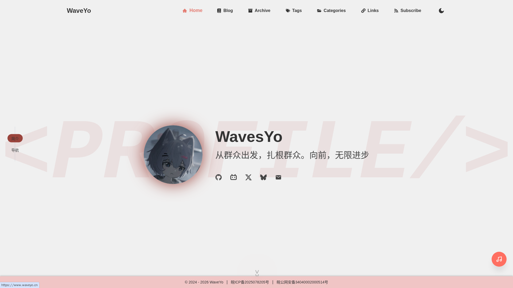 | 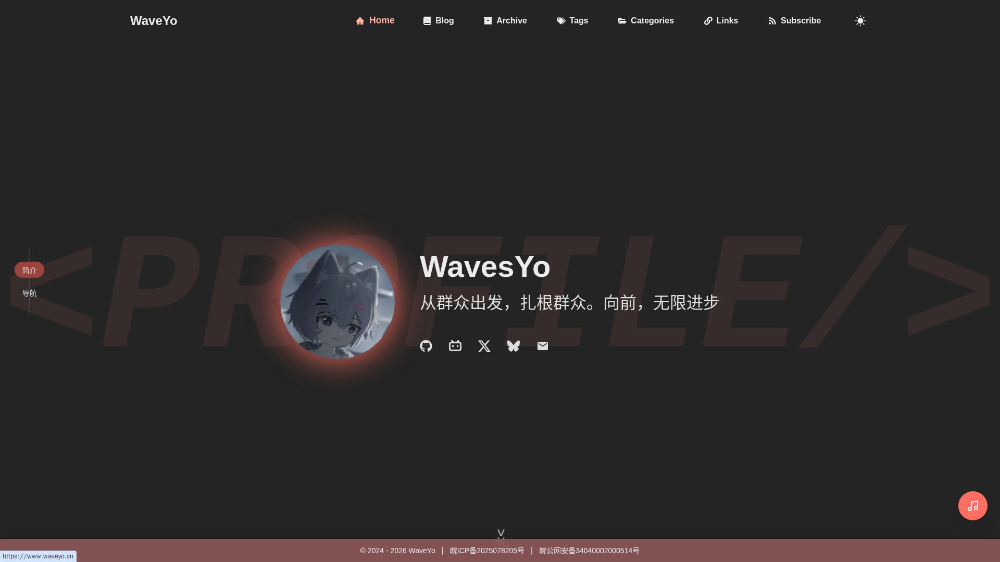 |
| 博客列表 | 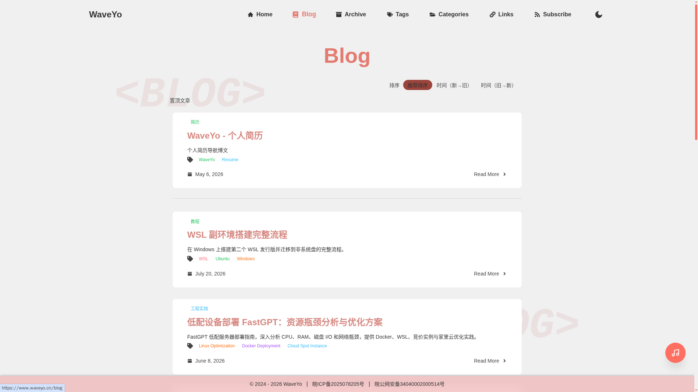 | 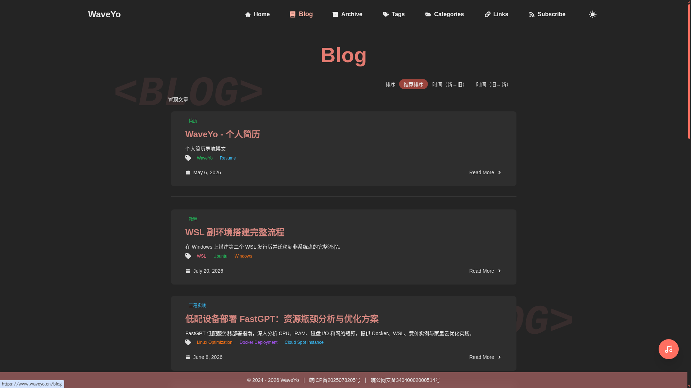 |
| Tags | 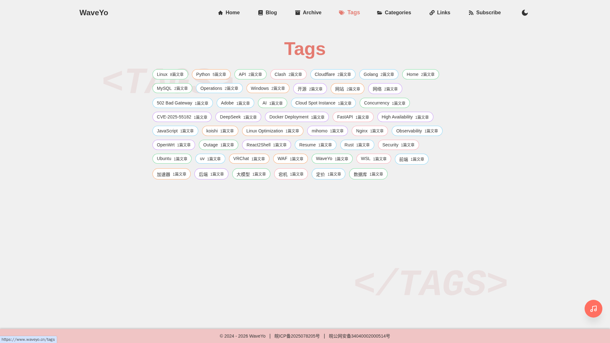 | 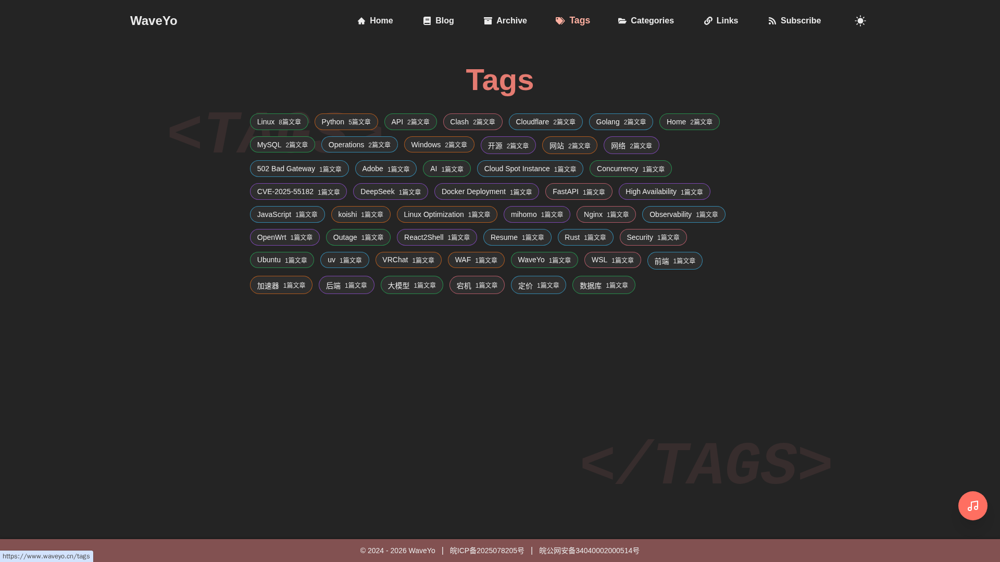 | 
| Categories | 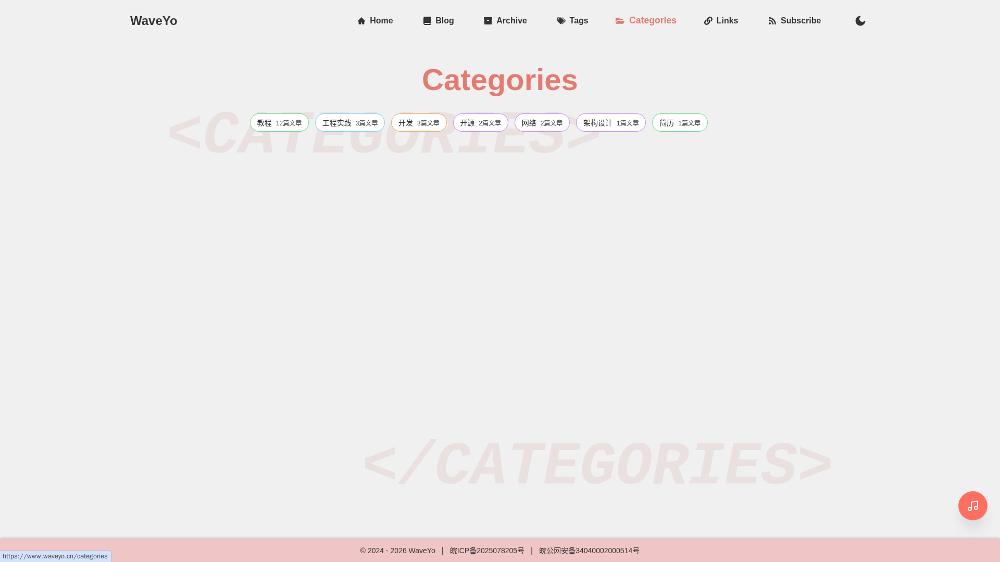 | 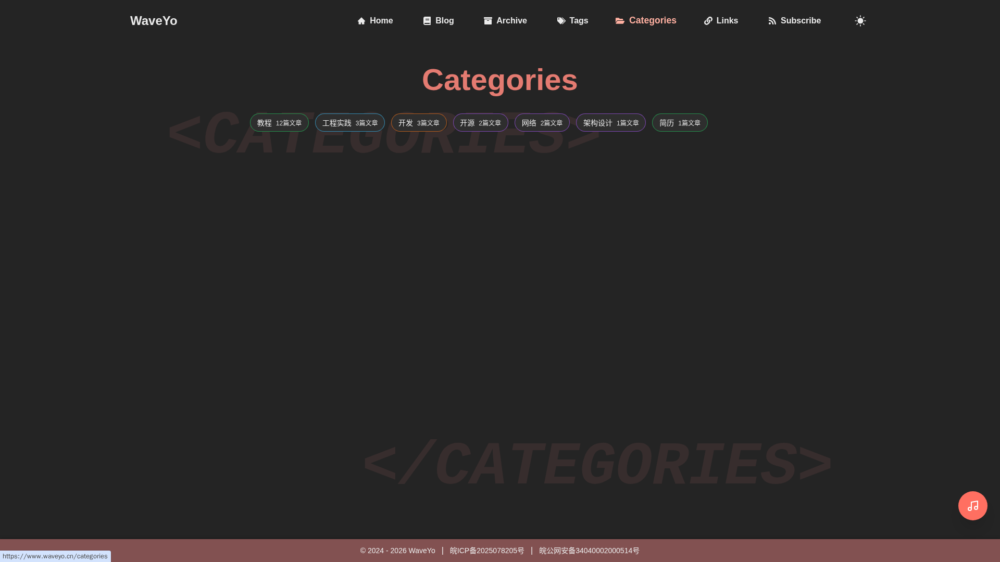 |
| Links | 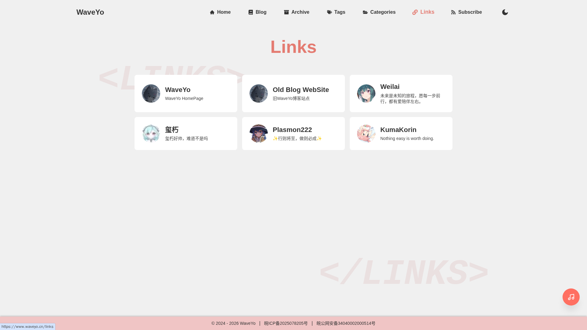 | 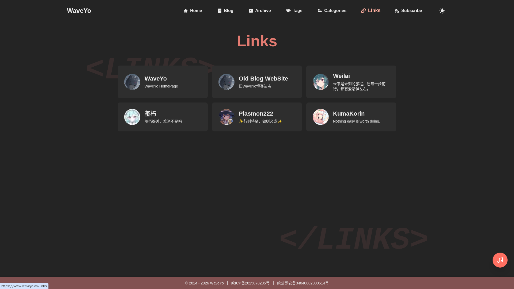 |
| Subscribe | 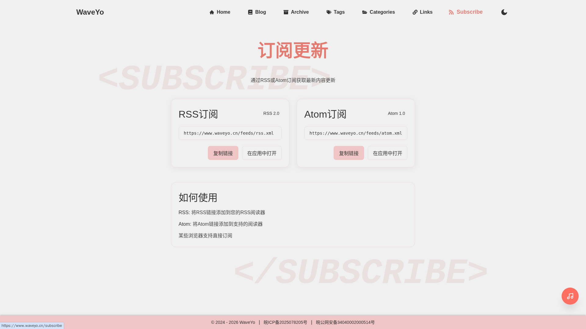 | 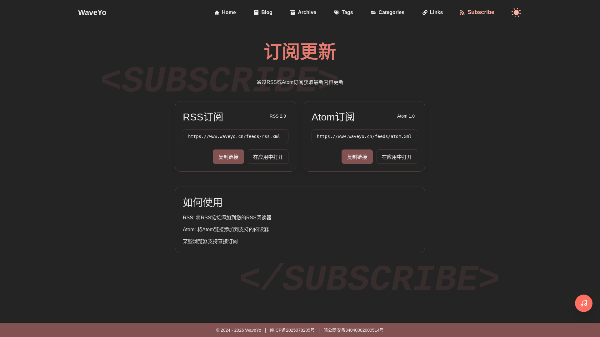 |
| 播放器 | 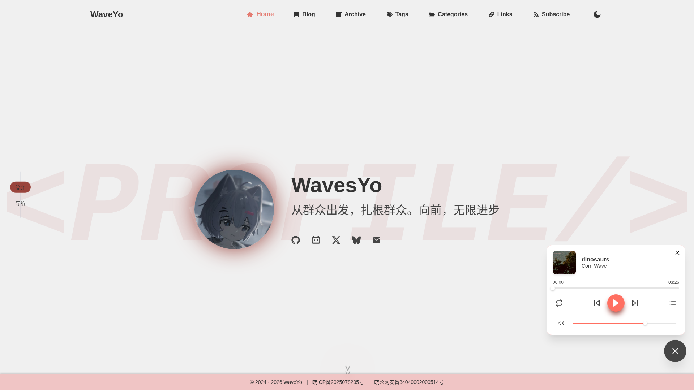 | 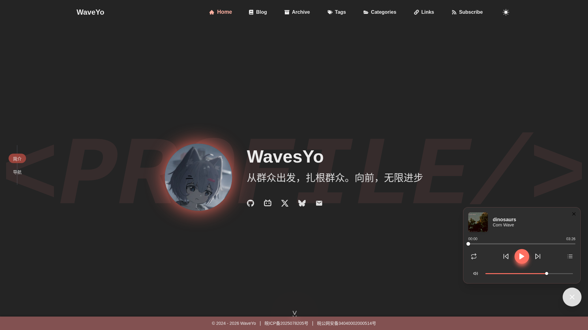 |
| 播放器列表 | 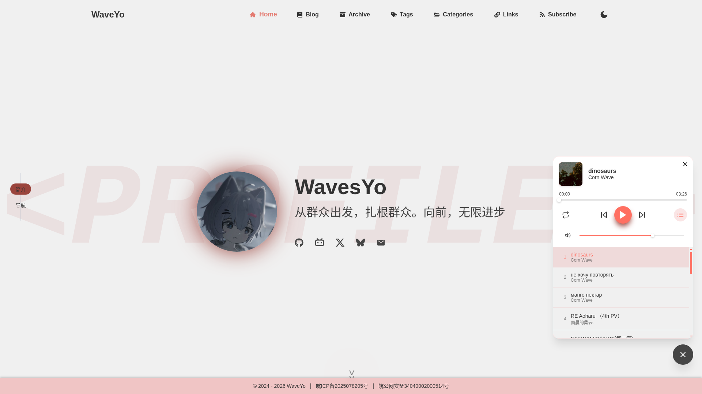 | 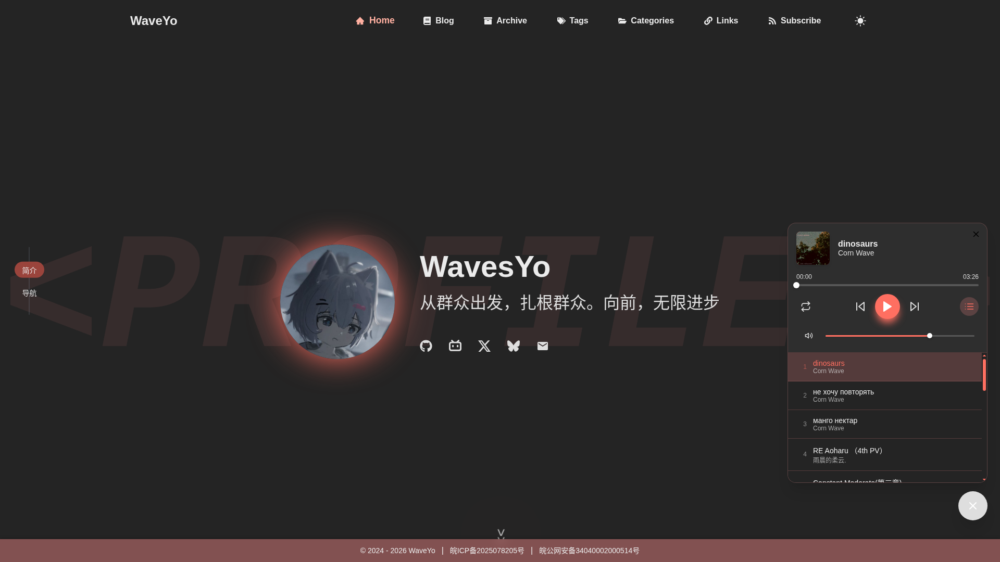 |
| Blog_Post | 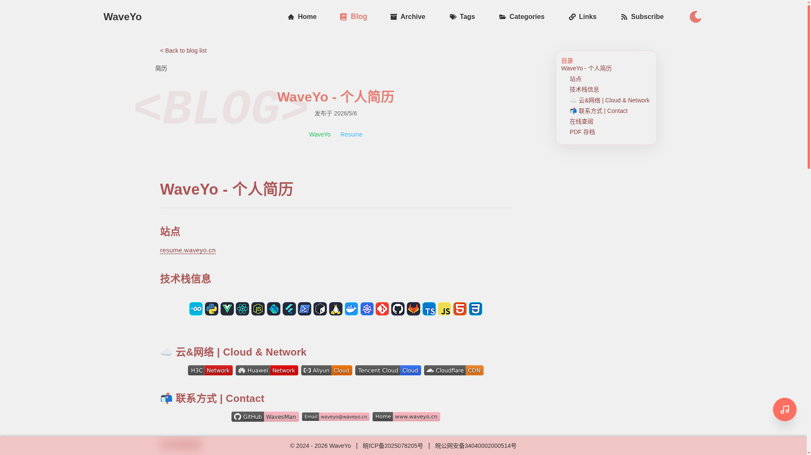 | 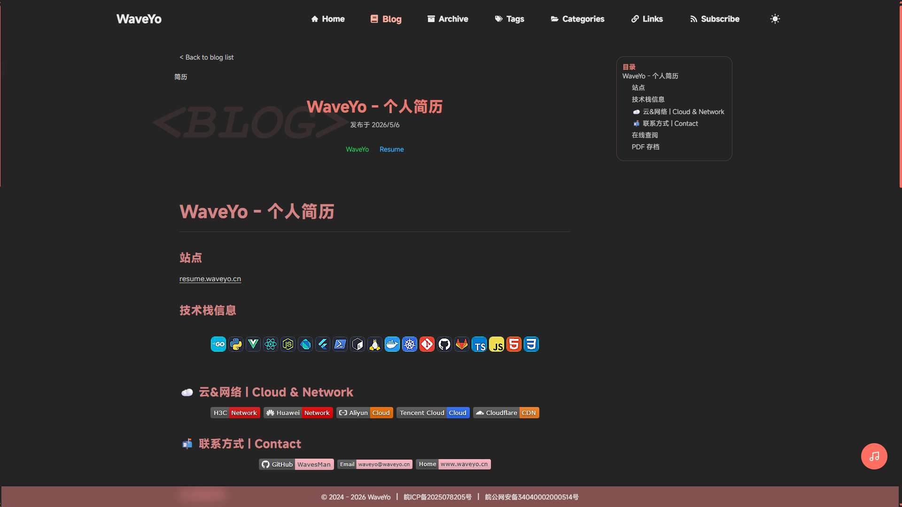 |


## 技术栈

- 框架：Next.js（App Router）
- 语言：TypeScript
- UI：React + CSS Modules
- 动效：framer-motion
- Markdown：gray-matter + react-markdown + remark-gfm + rehype-raw
- 代码高亮：react-syntax-highlighter（含一键复制）
- 拖拽实现：@hello-pangea/dnd  [参考实现：[超详细的实现 React 组件拖拽功能](https://juejin.cn/post/7168506198520987684)]
- 规范：ESLint

## 快速开始

### 本地化

建议使用 pnpm（仓库包含 pnpm-lock.yaml）。

1) 安装依赖

```bash
pnpm install
```

2) 配置环境变量

将 `.env.example` 复制为 `.env` 或 `.env.local`，按需修改。

3) 启动开发

```bash
pnpm dev
```

浏览器访问：`http://localhost:3000`

### 使用 Vercel 部署

#### 一键自动建仓
点击按钮自动在你的GitHub创建仓库，全程Vercel自动化部署，无需本地操作：
[](https://vercel.com/new/clone?repository-url=https://github.com/WavesMan/YoSpace.git)

## 常用脚本

```bash
# 本地开发
pnpm dev

# 构建
pnpm build

# 本地启动（需先 build）
pnpm start

# 代码检查
pnpm lint
```

## 环境变量配置

项目使用 `NEXT_PUBLIC_*` 形式的变量（会暴露到浏览器端），请避免在这些变量中放入敏感信息。

可以参考 [.env.example](./.env.example)。核心配置如下：

### Server Actions（反向代理 / CDN 场景）

- `SERVER_ACTIONS_ALLOWED_ORIGINS`：允许触发 Server Actions 的来源域名白名单（逗号分隔）。
- 适用场景：站点在 CDN / 反向代理套壳后，出现 `x-forwarded-host` 与 `origin` 不一致，导致 `Invalid Server Actions request`。
- 填写规则：仅填写域名（可包含端口），不要带协议（`https://`）与路径。
- 示例：`yospace.waveyo.cn,yospace-vercel.waveyo.cn`

### Contentful（可选）

仓库保留了 Contentful 的变量字段，但当前博客实现默认使用本地 Markdown 文件作为内容源。

- `NEXT_PUBLIC_CONTENTFUL_SPACE_ID`
- `NEXT_PUBLIC_CONTENTFUL_DELIVERY_TOKEN`
- `NEXT_PUBLIC_CONTENTFUL_BLOG_MODEL`
- `NEXT_PUBLIC_CONTENTFUL_BLOG_ORDER_TYPE`

### 博客

- `NEXT_PUBLIC_BLOG_ITEMS_PER_PAGE`：分页每页数量
- `NEXT_PUBLIC_BLOG_MODE`：`internal`（站内路由）或 `external`（跳转外部博客）
- `NEXT_PUBLIC_BLOG_URL`：外部博客地址（仅 `external` 模式生效）

### 国际化

- `NEXT_PUBLIC_I18N`：是否启用语言切换（`true/false`）

### 站点信息

- `NEXT_PUBLIC_SITE_TITLE` / `NEXT_PUBLIC_SITE_TITLE_EN`
- `NEXT_PUBLIC_NAV_TITLE` / `NEXT_PUBLIC_NAV_TITLE_EN`
- `NEXT_PUBLIC_SITE_DESCRIPTION` / `NEXT_PUBLIC_SITE_DESCRIPTION_EN`
- `NEXT_PUBLIC_PROFILE_NAMES` / `NEXT_PUBLIC_PROFILE_NAMES_EN`：多个名称用逗号分隔
- `NEXT_PUBLIC_PROFILE_IMAGE`
- `NEXT_PUBLIC_FAVICON_URL`

### SEO 配置

站点 SEO 统一使用配置文件管理：

- [`src/data/seo.json`](/src/data/seo.json)：SEO 配置入口（站点域名、默认标题/描述、分享图、sitemap 策略）
- [`src/data/seo.md`](/src/data/seo.md)：SEO 配置说明与示例

SEO 功能包含：

- 文章详情页基于 frontmatter 动态生成 metadata
- 标签/分类页首屏注入服务端数据，避免 CSR 空页面
- `/sitemap.xml` 与 `/robots.txt` 自动生成

### 备案信息（可选）

- `NEXT_PUBLIC_ICP_CODE`
- `NEXT_PUBLIC_POLICE_LICENSE`

### 音乐播放器

- `NEXT_PUBLIC_MUSIC_API_BASE`：音乐 API 基地址
- `NEXT_PUBLIC_MUSIC_USE_PROXY`：是否使用站内代理路径访问音乐 API（避免跨域问题）。设置为 `true` 或 `1` 启用；设置为 `false` 或 `0` 禁用；未设置时，若使用官方 API（`https://netmusic.waveyo.cn/`）则自动启用
- `NEXT_PUBLIC_MUSIC_PLAYLIST_ID`：播放列表 ID

项目在 [next.config.ts](./next.config.ts) 中配置了音乐 API 的反向代理：

- 本地访问：`/api/music-proxy/*`
- 转发到：`NEXT_PUBLIC_MUSIC_API_BASE` 对应的地址

当 `NEXT_PUBLIC_MUSIC_USE_PROXY` 启用时，播放器会通过站内代理路径请求，减少跨域问题。代理目标由 `NEXT_PUBLIC_MUSIC_API_BASE` 决定，不局限于官方 API。

> `netmusic.waveyo.cn` 所提供的API支持是免费的，但是运行维护是需要消耗资源的，如果您使用此API，希望能够前往 [dq.waveyo.cn](https://dq.waveyo.cn) 提供一些支持，并且备注信息赞助Music API，以支撑API运营。

### 友链管理

访问文件 `src\data\friendLinks.json` 修改 `json` 内容控制

json格式形如：( `subtitle` 可留空)

```json
[
    {
        "title": "WaveYo",
        "subtitle": "WaveYo HomePage",
        "link": "https://home.waveyo.cn",
        "avatar": "https://cloud.waveyo.cn//Services/websites/home/images/icon/favicon.ico"
    },
    {
        "title": "KumaKorin",
        "link": "https://korin.im",
        "avatar": "https://m1.miaomc.cn/uploads/20210623_b735dde7c665d.jpeg"
    },
]
```

### 个人社交链接管理

访问文件 `src\data\socialLinks.json` 修改 `json` 内容控制

json格式形如：

```json
[
  {
    "name": "bilibili",
    "url": "https://space.bilibili.com/204818057",
    "iconPackage": "fa6",
    "iconName": "FaBilibili"
  },
  {
    "name": "email",
    "url": "mailto:support@email.example",
    "iconPackage": "md",
    "iconName": "MdEmail"
  },
  {
    "name": "github",
    "url": "https://github.com",
    "iconPackage": "fa6",
    "iconName": "FaGithub"
  }
]
```

`iconName` `iconPackage` 参阅 [GitHub Repo | React Icons](https://github.com/react-icons/react-icons) 与 [React Icons](https://react-icons.github.io/react-icons/) 说明

## 内容管理（本地 Markdown）

本地文章位于：`src/content/posts/`

- 英文：`slug.md`
- 中文：`slug.zh-CN.md`

文章使用 Front Matter 描述基础信息，示例：

```md
---
title: "欢迎来到我的博客"
description: "这是一篇使用 Markdown 文件的示例文章。"
date: "2026-01-20T10:00:00Z"
tags: ["Next.js", "Markdown"]
---

正文内容...
```

## 目录结构

```text
src/
  app/                Next.js 路由与布局（App Router）
  actions/            Server Actions（如博客内容读取）
  components/         业务组件
    Blog/             博客相关组件
    Links/            友链相关组件
    MusicPlayer/      音乐播放器（Hooks + 子组件）
    Common/           通用组件（Header/Footer/ProgressBar 等）
  content/posts/      本地 Markdown 文章
  context/            全局上下文（国际化）
  data/               静态数据（社交链接、友链）
  locales/            语言包
  utils/              工具与内容读取逻辑
public/               静态资源
```

## 部署建议

- 适合部署到 Vercel、Netlify 或自建 Node 服务。
- 部署前确保配置好环境变量（尤其是站点信息与音乐 API）。
- 构建命令：`pnpm build`，启动命令：`pnpm start`。

### 部署你自己的Music API？

本项目源码使用的Music API为 [API Enhanced](https://github.com/neteasecloudmusicapienhanced/api-enhanced)，你可以按照此仓库提供的Docs描述自行部署API。

## 常见问题

### 音乐无法播放 / 歌单加载失败

- 检查 `NEXT_PUBLIC_MUSIC_API_BASE` 与 `NEXT_PUBLIC_MUSIC_PLAYLIST_ID` 是否正确。
- `netmusic.waveyo.cn` 所提供的API支持是免费的，但是运行维护是需要消耗资源的，如果您使用此API，希望能够前往 [dq.waveyo.cn](https://dq.waveyo.cn) 提供一些支持，并且备注信息赞助Music API，以支撑API运营。

### 文章列表为空

- 确认 `src/content/posts/` 下存在对应语言的文章文件。
- 中文文件名需为 `*.zh-CN.md`，英文为 `*.md`。

## 版本更新

> 过去的版本更新未做 Tag 归档固化，以最新 [2026/08/08 8f7f5f9d](https://github.com/WavesMan/YoSpace/commit/8f7f5f9d6dd9bbfd85b70f638fe12fb2dba879c0) 发布为最新最初发布版本 v1.0.0
 
#### v1.0.0 2026/08/08

- 实现 Markdown 图片灯箱预览组件，支持缩放、拖拽、双击切换等功能
- 添加 SVG 锐化滤镜，提升正文图片清晰度
- 正文图片统一使用原始地址，避免依赖 Next 图片优化或运行时代理
- 播放器唱片封面统一使用原始地址，避免依赖 Next 图片优化或运行时代理
- 添加全局滚动条样式变量和主题化滚动条类